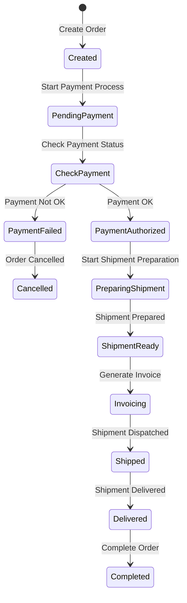

# state-machine
An agnostic State Machine PHP Package that provides flexible, framework-independent solution for managing states and transitions

## Installation

- TODO

## Usage

### Define a state machine definition

**state-machine.json**
```json
{
  "name": "State machine name",
  "states": [
    {
      "name": "New"
    },
    {
      "name": "Created"
    },
    {
      "name": "PendingPayment"
    },
    {
      "name": "CheckPayment"
    },
    {
      "name": "Cancelled"
    },
    {
      "name": "PaymentAuthorized"
    },
    {
      "name": "PaymentFailed"
    },
    {
      "name": "PreparingShipment"
    },
    {
      "name": "ShipmentReady"
    },
    {
      "name": "Invoicing"
    },
    {
      "name": "Shipped"
    },
    {
      "name": "Delivered"
    },
    {
      "name": "Completed"
    }
  ],
  "transitions": [
    {
      "from": "New",
      "to": "Created",
      "event": "Create Order",
      "condition": "Tlab\\StateMachine\\Conditions\\SampleCondition"
    },
    {
      "from": "Created",
      "to": "PendingPayment",
      "event": "Start Payment Process",
      "condition": null
    },
    {
      "from": "PendingPayment",
      "to": "CheckPayment",
      "event": "Check Payment Status",
      "condition": null
    },
    {
      "from": "CheckPayment",
      "to": "PaymentAuthorized",
      "event": "Payment OK",
      "condition": null
    },
    {
      "from": "CheckPayment",
      "to": "PaymentFailed",
      "event": "Payment Not OK",
      "condition": null
    },
    {
      "from": "PaymentFailed",
      "to": "Cancelled",
      "event": "Order Cancelled",
      "condition": null
    },
    {
      "from": "PaymentAuthorized",
      "to": "PreparingShipment",
      "event": "Start Shipment Preparation",
      "condition": null
    },
    {
      "from": "PreparingShipment",
      "to": "ShipmentReady",
      "event": "Shipment Prepared",
      "condition": null
    },
    {
      "from": "ShipmentReady",
      "to": "Invoicing",
      "event": "Generate Invoice",
      "condition": null
    },
    {
      "from": "Invoicing",
      "to": "Shipped",
      "event": "Shipment Dispatched",
      "condition": null
    },
    {
      "from": "Shipped",
      "to": "Delivered",
      "event": "Shipment Delivered",
      "condition": null
    },
    {
      "from": "Delivered",
      "to": "Completed",
      "event": "Complete Order",
      "condition": null
    }
  ],
  "events": [
    {
      "name": "Create Order",
      "command": "Tlab\\StateMachine\\Commands\\SampleCommand"
    },
    {
      "name": "Start Payment Process",
      "command": null
    },
    {
      "name": "Check Payment Status",
      "command": null
    },
    {
      "name": "Payment OK",
      "command": null
    },
    {
      "name": "Payment Not OK",
      "command": null
    },
    {
      "name": "Order Cancelled",
      "command": null
    },
    {
      "name": "Start Shipment Preparation",
      "command": null
    },
    {
      "name": "Shipment Prepared",
      "command": null
    },
    {
      "name": "Generate Invoice",
      "command": null
    },
    {
      "name": "Shipment Dispatched",
      "command": null
    },
    {
      "name": "Shipment Delivered",
      "command": null
    },
    {
      "name": "Complete Order",
      "command": null
    }
  ]
}

```

```php
$definition = file_get_contents('state-machine.json');
$stateMachineRunner = new StateMachineRunner();

$data = [
    'id' => 1,
    'clientId' => 999,
    'products' => [
        [
            'sku' => 'SKU-1',
            'price' => 10.00,
            'qnt' => 1,
        ]
    ],
];

$newState = $stateMachineRunner->run('Created', 'Start Payment Process', $data);

```


### Sample


