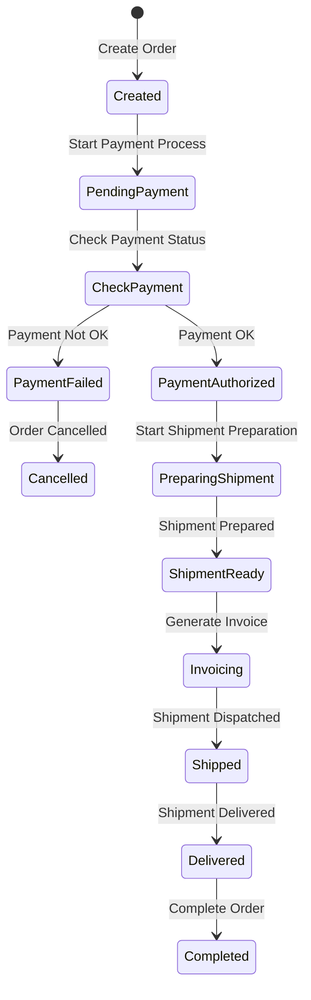

# state-machine
An agnostic State Machine PHP Package that provides flexible, framework-independent solution for managing states and transitions

### Sample

```mermaid
stateDiagram-v2
    [*] --> Created: Create Order
    Created --> PendingPayment : Start Payment Process
    PendingPayment --> CheckPayment : Check Payment Status
    CheckPayment --> PaymentAuthorized : Payment OK
    CheckPayment --> PaymentFailed : Payment Not OK
    PaymentFailed --> Cancelled : Order Cancelled
    PaymentAuthorized --> PreparingShipment : Start Shipment Preparation
    PreparingShipment --> ShipmentReady : Shipment Prepared
    ShipmentReady --> Invoicing : Generate Invoice
    Invoicing --> Shipped : Shipment Dispatched
    Shipped --> Delivered : Shipment Delivered
    Delivered --> Completed : Complete Order
```
