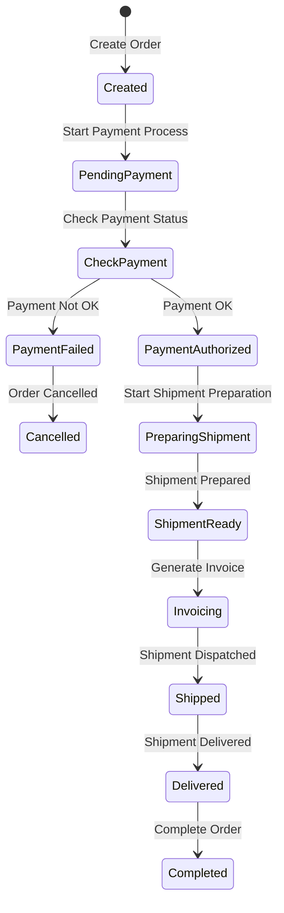

# state-machine
An agnostic State Machine PHP Package that provides flexible, framework-independent solution for managing states and transitions

## Installation

- TODO

## Usage

### Define you business model

This state machine represents the flow of how a real estate agency interacts with a client from the first point of contact until the deal is closed or the client exits the process.

#### Real Estate Agency Client Interaction State Machine Example

**States:**

- Initial Contact: Client has contacted the agency for the first time (e.g., via a phone call, email, or website form).
- Qualification: The agency qualifies the client by determining their needs, preferences, and budget.
- Property Search: The agent is actively searching for properties that meet the client’s criteria.
- Property Viewing: The client is viewing one or more properties.
- Offer/Negotiation: The client has made an offer, and the agent is negotiating on their behalf.
- Contract Signing: The client is signing the contract after a successful negotiation.
- Deal Closed: The deal is successfully closed, and the client has purchased or rented the property.
- Client Exit: The client leaves the process without closing the deal, either by choice or because no suitable property was found.

**Events/Transitions:**

- Client Inquires: Client contacts the agency for the first time (moves from Idle to Initial Contact).
- Agent Qualifies Client: Agent gathers information about the client’s needs, preferences, and budget (moves from Initial Contact to Qualification).
- Start Property Search: Agent starts searching for properties (moves from Qualification to Property Search).
- Property Found: Agent finds a potential property for the client (moves from Property Search to Property Viewing).
- Client Interested in Property: Client is interested in one or more properties (moves from Property Viewing to Offer/Negotiation).
- Successful Negotiation: An agreement is reached on the terms (moves from Offer/Negotiation to Contract Signing).
- Deal Completed: The contract is signed, and the deal is closed (moves from Contract Signing to Deal Closed).
- No Suitable Property Found: No property was found, or the client is no longer interested (moves from Property Search to Client Exit).
- Client Declines Offer: Client declines the offer after viewing properties (moves from Offer/Negotiation to Client Exit).
- Client Walks Away: Client decides to leave the process at any stage (transitions to Client Exit from any previous state).

#### Explanation:

The client interaction starts with Initial Contact when the client first reaches out to the agency.

The agent then moves to Qualification, where they determine the client’s requirements, budget, and preferences.

Once the client's profile is established, the agent enters Property Search, looking for suitable properties.

When a property is found, the client moves to the Property Viewing stage to visit one or more properties.

If the client is interested, the process moves to Offer/Negotiation where the agent negotiates with the property owner on behalf of the client.

If the negotiation is successful, the process transitions to Contract Signing and finally to Deal Closed when the agreement is finalized.

At various stages (like Property Search, Viewing, or Negotiation), the client may decide to exit the process, and the system moves to Client Exit

### State machine definition file

**state-machine.json**
```json
{
  "name": "Real Estate Agency Client Interaction",
  "states": [
    {
      "name": "Idle"
    },
    {
      "name": "Initial Contact"
    },
    {
      "name": "Qualification"
    },
    {
      "name": "Property Search"
    },
    {
      "name": "Property Viewing"
    },
    {
      "name": "Offer/Negotiation"
    },
    {
      "name": "Contract Signing"
    },
    {
      "name": "Deal Closed"
    },
    {
      "name": "Client Exit"
    }
  ],
  "transitions": [
    {
      "from": "Initial Contact",
      "to": "New Request",
      "event": "Client Submits Request",
      "condition": null
    }
  ],
  "events": [
    {
      "name": "Client Inquires",
      "command": null
    },
    {
      "name": "Agent Qualifies Client",
      "command": null
    },
    {
      "name": "Start Property Search",
      "command": null
    },
    {
      "name": "Property Found",
      "command": null
    },
    {
      "name": "Client Interested in Property",
      "command": null
    },
    {
      "name": "Successful Negotiation",
      "command": null
    },
    {
      "name": "Deal Completed",
      "command": null
    },
    {
      "name": "No Suitable Property Found",
      "command": null
    },
    {
      "name": "Client Declines Offer",
      "command": null
    },
    {
      "name": "Client Walks Away",
      "command": null
    }
  ]
}

```

```php
$definition = file_get_contents('state-machine.json');
$stateMachineRunner = new StateMachineRunner();

$data = [
    'id' => 1,
    'clientId' => 999,
    'products' => [
        [
            'sku' => 'SKU-1',
            'price' => 10.00,
            'qnt' => 1,
        ]
    ],
];

$newState = $stateMachineRunner->run('Created', 'Start Payment Process', $data);

```


### Sample


