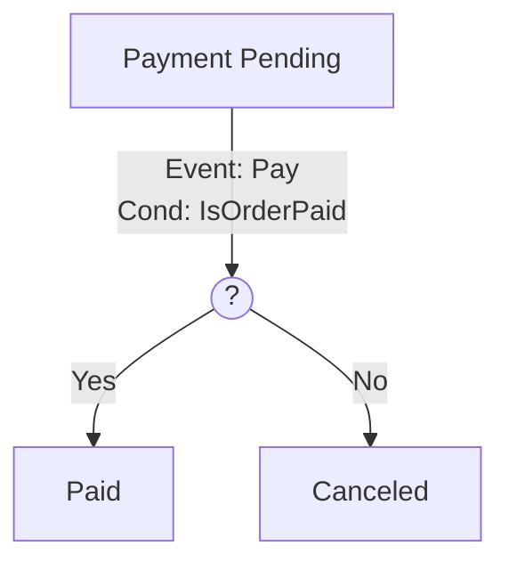
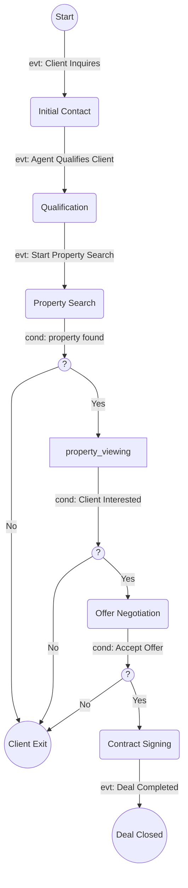

# state-machine
An agnostic State Machine PHP Package that provides flexible, framework-independent solution for managing states and transitions

## State machine components

Organizations frequently require highly specialized business processes that must be continuously iterated and improved. Instead of hardcoding each process or extending the default functionality of a commerce platform, a model-driven approach can be applied.
The order workflow is defined as a state machine, using discrete states and transitions, and serialized into a JSON representation.
This JSON model is parsed and executed by the system runtime, removing the need to implement process logic manually in code.

A separate state machine can be defined for each distinct process within your application. For instance, the workflow for handling credit card payments may differ significantly from that of invoice-based orders.
By modeling each process with its own dedicated state machine, you can tailor the behavior to its specific requirements.
When a new order is submitted, the system can dynamically select the appropriate state machine from the available set to handle the order lifecycle accordingly.

### States
States help track the progress of sales orders throughout their lifecycle. They represent various stages in your order 
processing workflow. 

For example:

- In build-to-order scenarios, a "Production Complete" state indicates manufacturing is finished
- For digital products, a "Customer Download Available" state shows when downloads are ready
- With physical goods, a "Shipped" state confirms that items have been dispatched to customers

Each state reflects a specific milestone in the order fulfillment process, allowing for better tracking and management.

A list of state elements can be defined with this simple JSON. 
First, the state has a name that allows referencing the state.

```
"states": [
    {
      "name": "new"
    },
    {
      "name": "paid"
    },
    {
      "name": "shipped"
    },
    ....
]
```

### Transitions
States are connected through transitions, similar to a directed graph. Each transition is triggered by a specific event 
that determines when an order can move from one state to another. For example, the "Waiting for Credit Card Capture" 
state transitions to the "Captured" state when the "Capture Successful" event occurs.

These transitions define both the possible paths a sales order can take and the paths that are not allowed, ensuring 
that orders follow a logical and controlled progression through their lifecycle.

Transitions are straightforward:

- They connect a source state to a target state
- An event determines when the transition can occur

This simple structure allows for flexible state management while maintaining clear rules for state progression.

```
"transitions": [
    {
      "source": "Start",
      "target": "InitialContact",
      "event": "ClientInquires",
      "condition": null
    },
    {
      "source": "InitialContact",
      "target": "Qualification",
      "event": "AgentQualifiesClient",
      "condition": null
    },
    ...
]
```
### Conditions

#### Boolean conditions
A transition can be conditioned: the state machine can move from one state to another if a certain condition associated 
with that transition is being satisfied. This can be modeled in the JSON file that describes the process, as in the following example:

```
{
  "source": "paid",
  "target": "shipped",
  "event": "ship it",
  "condition": "Tlab\StateMachine\Conditions\PaymentIsCompleted"
}
```
In this case when the transition is triggered, the system will check if the payment is completed. If it is, the transition will be allowed, otherwise it will not be allowed, and the state machine will remain in the current state.
Conditions can be any class that implements the `ConditionInterface`.

#### if-else conditions

There are cases where a transition can be conditioned based on a boolean condition. For this case we create two transitions, the first one is the transition in case of the boolean condition being satisfied, and the second one is the transition in case of the boolean condition not being satisfied.
Note that the two transitions must have the same event name. Only the condition of the first transition is checked, and if it is satisfied, the transition is allowed. Otherwise the state machine moves to the target state of the second transition.

```
{
  "source": "payment-pending",
  "target": "paid",
  "event": "pay",
  "condition": "Tlab\StateMachine\Conditions\IsOrderPaid"
},
{
  "source": "payment-pending",
  "target": "cancelled",
  "event": "pay"
}
```


```mermaid
  flowchart TD
    payment_pending[Payment Pending]
    paid[Paid]
    canceled[Canceled]
    A((?))

    payment_pending --> | Event: Pay <br> Cond: IsOrderPaid |A
    A --> |Yes| paid
    A --> |No|canceled
```

## Events

Events are the triggers that cause state transitions. Each event has a name and an optional command associated with it. The command is a class that implements the `CommandInterface`. Commands are executed when the state jumps to the target state of the transition.

```json
"events": [
    {
      "name": "ClientInquires",
      "command": "Tlab\\StateMachine\\Conditions\\SendEmail",
      "onEnter": false,
      "timeout": false,
      "manual": false
    },
    {
      "name": "AgentQualifiesClient",
      "command": null,
      "onEnter": false,
      "timeout": false,
      "manual": false
    },
    {
      "name": "StartPropertySearch",
      "command": null
    },
    {
      "name": "PropertyFound",
      "command": null
    }
  ]
```


## Installation

- TODO

## Usage

### Define you business model

This state machine represents the flow of how a real estate agency interacts with a client from the first point of contact until the deal is closed or the client exits the process.

#### Real Estate Agency Client Interaction State Machine Example

**States:**

- Initial Contact: Client has contacted the agency for the first time (e.g., via a phone call, email, or website form).
- Qualification: The agency qualifies the client by determining their needs, preferences, and budget.
- Property Search: The agent is actively searching for properties that meet the client’s criteria.
- Property Viewing: The client is viewing one or more properties.
- Offer/Negotiation: The client has made an offer, and the agent is negotiating on their behalf.
- Contract Signing: The client is signing the contract after a successful negotiation.
- Deal Closed: The deal is successfully closed, and the client has purchased or rented the property.
- Client Exit: The client leaves the process without closing the deal, either by choice or because no suitable property was found.

**Events/Transitions:**

- Client Inquires: Client contacts the agency for the first time (moves from Start to Initial Contact).
- Agent Qualifies Client: Agent gathers information about the client’s needs, preferences, and budget (moves from Initial Contact to Qualification).
- Start Property Search: Agent starts searching for properties (moves from Qualification to Property Search).
- Property Found: Agent finds a potential property for the client (moves from Property Search to Property Viewing).
- Client Interested in Property: Client is interested in one or more properties (moves from Property Viewing to Offer/Negotiation).
- Successful Negotiation: An agreement is reached on the terms (moves from Offer/Negotiation to Contract Signing).
- Deal Completed: The contract is signed, and the deal is closed (moves from Contract Signing to Deal Closed).
- No Suitable Property Found: No property was found, or the client is no longer interested (moves from Property Search to Client Exit).
- Client Declines Offer: Client declines the offer after viewing properties (moves from Offer Negotiation to Client Exit).
- Client Walks Away: Client decides to leave the process at any stage (transitions to Client Exit from any previous state).

#### Explanation:

The client interaction starts with Initial Contact when the client first reaches out to the agency.

The agent then moves to Qualification, where they determine the client’s requirements, budget, and preferences.

Once the client's profile is established, the agent enters Property Search, looking for suitable properties.

When a property is found, the client moves to the Property Viewing stage to visit one or more properties.

If the client is interested, the process moves to Offer/Negotiation where the agent negotiates with the property owner on behalf of the client.

If the negotiation is successful, the process transitions to Contract Signing and finally to Deal Closed when the agreement is finalized.

At various stages (like Property Search, Viewing, or Negotiation), the client may decide to exit the process, and the system moves to Client Exit

> Event names should be verbs/actions like ship, pay, authorize, while state names must express that something happened or will happen (like paid or payment pending, closed, cancelled).

### State machine definition file

**state-machine.json**
```json
{
  "name": "Real Estate Agency Client Interaction",
  "states": [
    {
      "name": "Start"
    },
    {
      "name": "InitialContact"
    },
    {
      "name": "Qualification"
    },
    {
      "name": "PropertySearch"
    },
    {
      "name": "PropertyViewing"
    },
    {
      "name": "OfferNegotiation"
    },
    {
      "name": "ContractSigning"
    },
    {
      "name": "DealClosed"
    },
    {
      "name": "ClientExit"
    }
  ],
  "transitions": [
    {
      "source": "Start",
      "to": "InitialContact",
      "event": "ClientInquires",
      "condition": null
    },
    {
      "source": "InitialContact",
      "to": "Qualification",
      "event": "AgentQualifiesClient",
      "condition": null
    },
    {
      "source": "Qualification",
      "to": "PropertySearch",
      "event": "StartPropertySearch",
      "condition": null
    },
    {
      "source": "PropertySearch",
      "to": "PropertyViewing",
      "event": "PropertyFound",
      "condition": "SearchProperty::class"
    },
    {
      "source": "PropertySearch",
      "to": "ClientExit",
      "event": "NoSuitablePropertyFound",
      "condition": null
    },
    {
      "source": "PropertyViewing",
      "to": "OfferNegotiation",
      "event": "ClientInterested",
      "condition": null
    },
    {
      "source": "PropertyViewing",
      "to": "ClientExit",
      "event": "SuccessfulNegotiation",
      "condition": null
    },
    {
      "source": "OfferNegotiation",
      "to": "ContractSigning",
      "event": "SuccessfulNegotiation",
      "condition": null
    },
    {
      "source": "ContractSigning",
      "to": "DealClosed",
      "event": "DealCompleted",
      "condition": null
    }
  ],
  "events": [
    {
      "name": "ClientInquires",
      "command": null
    },
    {
      "name": "AgentQualifiesClient",
      "command": null
    },
    {
      "name": "StartPropertySearch",
      "command": null
    },
    {
      "name": "PropertyFound",
      "command": null
    },
    {
      "name": "SuccessfulNegotiation",
      "command": null
    },
    {
      "name": "DealCompleted",
      "command": null
    },
    {
      "name": "ClientInterested",
      "command": null
    },
    {
      "name": "NoSuitablePropertyFound",
      "command": null
    },
    {
      "name": "ClientDeclinesOffer",
      "command": null
    },
    {
      "name": "ClientWalksAway",
      "command": null
    }
  ]
}
```

```php
$jsonDefinition = file_get_contents('state-machine.json');

echo ((new Designer())->renderGraph($jsonDefinition));
```


### Diagram


```mermaid
graph TD
    A((?))
    B((?))
    C((?))
    initial_contact(Initial Contact)
    start((Start))
    qualification(Qualification)
    property_search(Property Search)
    offer_negotiation(Offer Negotiation)
    client_exit((Client Exit))
    contract_signing(Contract Signing)
    deal_closed((Deal Closed))

    start ---> |evt: Client Inquires| initial_contact
    initial_contact ---> |evt: Agent Qualifies Client| qualification
    qualification ---> |evt: Start Property Search| property_search
    property_search --> |cond: property found|A
    A ---> |No| client_exit
    A ---> |Yes| property_viewing
    property_viewing ---> |cond: Client Interested|B
    B --> |Yes| offer_negotiation
    B --> |No| client_exit
    offer_negotiation --> |cond: Accept Offer|C
    C --> |Yes| contract_signing
    C --> |No| client_exit
    contract_signing --> |evt: Deal Completed| deal_closed
```


