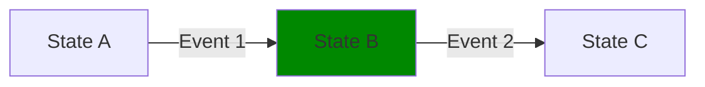

# States in State Machine

## Overview
States represent the various stages that an entity (like an order, document, or process) can be in during its lifecycle. This guide provides in-depth information about states, their properties, and best practices for working with them.

## State Types

### 1. Initial State
The starting point of the state machine.

**Characteristics:**
- Only one initial state per state machine
- Entry point for new items
- Should have clear entry conditions

**Example Configuration:**
```json
{
"states": [
  {
    "name": "new",
    "isCurrent": true
  }
]
}
```

### 2. Intermediate States
Temporary states that represent work in progress.

**Characteristics:**
- Have both incoming and outgoing transitions
- Represent active processing stages

**Example Configuration:**
```json
{
  "states": [
    {
      "name": "in_review"
    }
  ]
}
```

### 3. Terminal States
End states with no outgoing transitions.

**Characteristics:**
- Represent final outcomes
- No further state changes allowed
- Should be clearly named to indicate completion (e.g., `completed`, `cancelled`, `rejected`)

**Example Configuration:**
```json
{
  "states": [
    {
      "name": "completed"
    }
  ]
}
```

## State Properties

### Core Properties
- **name**: Unique identifier for the state (required)
- **isCurrent**: Boolean indicating if this is the current state of the state machine

## Best Practices

### Naming Conventions
- Use present tense (e.g., `processing` not `processed`)
- Be specific about the state's meaning
- Use snake_case for consistency

### State Design
- Keep the number of states manageable
- Avoid too many transitions between states
- Document the purpose and rules of each state

### Error Handling
- Define clear error states
- Provide clear error messages for invalid state transitions

### Example State Machine

#### State Machine Definition (JSON)
```json
{
  "name": "Example State machine",
  "states": [
    {
      "name": "State A",
      "isCurrent": false
    },
    {
      "name": "State B",
      "isCurrent": true
    },
    {
      "name": "State C",
      "isCurrent": false
    },
  ],
  "transitions": [
    {
      "source": "State A",
      "target": "State B",
      "event": "Event 1",
      "condition": null
    },
    {
      "source": "State B",
      "target": "State C",
      "event": "Event 2",
      "condition": null
    }
  ],
  "events": [
    {
      "name": "Event 1",
      "command": null
    },
    {
      "name": "Event 2",
      "command": null
    }
  ]
}
```

#### Example State Diagram (Mermaid)


