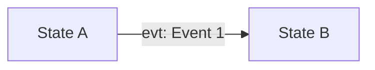
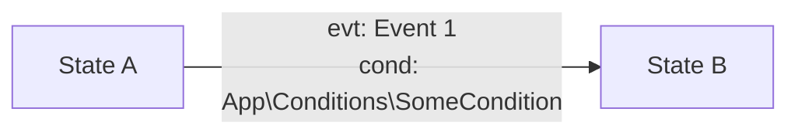
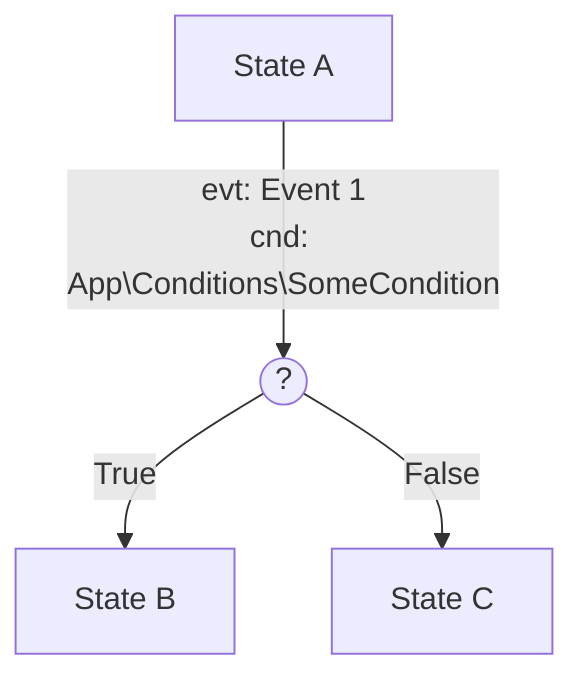

# Transitions in State Machine

## Overview
Transitions define the allowed movements between states in a state machine. They are the core mechanism by which entities change their state in response to events, conditions, or timeouts. This guide explains transition properties, types, and best practices for implementing robust workflows.

## Transition Structure
A transition connects a source state to a target state and specifies the event and any conditions required for the transition to occur.

**Example Configuration:**
```json
{
  "source": "pending_payment",
  "target": "paid",
  "event": "process_payment",
  "condition": "App\\Conditions\\PaymentIsValid"
}
```

## Transition Properties
- **source**: Name of the state from which the transition starts (required)
- **target**: Name of the state to which the transition leads (required)
- **event**: Name of the event that triggers the transition (required)
- **condition**: (Optional) Class that must evaluate to true for the transition to be allowed

## Transition Types

### 1. Event-Driven Transitions
Triggered by explicit events

**Example:**
```json
{
  "name": "Example State machine",
  "states": [
    {
      "name": "State A",
      "isCurrent": false
    },
    {
      "name": "State B",
      "isCurrent": true
    }
  ],
  "transitions": [
    {
      "source": "State A",
      "target": "State B",
      "event": "Event 1",
      "condition": null
    }
  ],
  "events": [
    {
      "name": "Event 1",
      "command": null
    }
  ]
}
```

#### Example State Diagram (Mermaid)



### 2. Conditioned Transitions
Only allowed if a specific condition is met.
If condition is not met, the transition is not allowed and state machine remains in the source state.

**Example:**
```json
{
  "name": "Example State machine",
  "states": [
    {
      "name": "State A"
    },
    {
      "name": "State B"
    }
  ],
  "transitions": [
    {
      "source": "State A",
      "target": "State B",
      "event": "Event 1",
      "condition": "App\\Conditions\\SomeCondition"
    }
  ],
  "events": [
    {
      "name": "Event 1",
      "command": null
    }
  ]
}
```

#### Example State Diagram (Mermaid)



### 3. If-Else transitions

If-else transitions allow you to control the target state based on the condition.

**Example:**
```json
{
  "name": "Example State machine",
  "states": [
    {
      "name": "State A"
    },
    {
      "name": "State B"
    },
    {
      "name": "State C"
    }
  ],
  "transitions": [
    {
      "source": "State A",
      "target": "State B",
      "event": "Event 1",
      "condition": "App\\Conditions\\SomeCondition"
    },
    {
      "source": "State A",
      "target": "State C",
      "event": "Event 1"
    }
  ],
  "events": [
    {
      "name": "Event 1",
      "command": null
    }
  ]
}
```

#### Example State Diagram (Mermaid)



## Transition Lifecycle
1. **Current state** is checked for outgoing transitions.
2. **Event** is triggered (manually, onEnter, or via timeout).
3. **Conditions** are evaluated (if any).
4. **Transition** is executed if allowed:
    - State changes from source to target
    - Any associated command/action is executed
    - Side effects (notifications, logging, etc.) are handled

## Best Practices
- Always define clear source and target states
- Use conditions to enforce business rules
